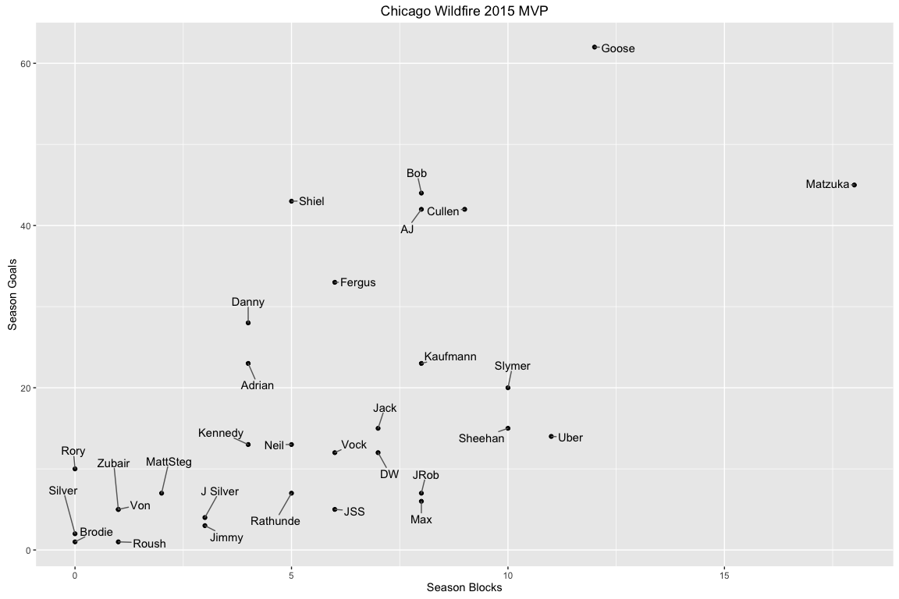

# Bring the Heat

***

Outline
=====
* About:
    + Info on the [Wildfire](http://theaudl.com/teams/wildfire)
    + Data from [UltiAnalytics](http://www.ultianalytics.com/app/#/5671536392404992/players)
    + More extensive code in `bh_prep.R`, `bh_stats.R`, and `bh_plot.R`
* Pre-process:
    + Standardize names and dates
    + Get data in tidy format
* Analyze:
    + Calculate each player's plus-minus
* Plot:
    + Plot season blocks vs. season goals to determine Wildfire MVP

***

 

***

<br /><br /><br />

## Munge

__Load packages__  
using `pacman`


```r
library(pacman)
```


```r
p_load(knitr,  # for weaving this into pretty format
       readr,  # for read_csv()
       tibble,  # for an easier way to work with data.frames
       dplyr,  # for data manipulation
       stringr,  # for string manipulation
       lubridate,  # for dates
       tidyr,  # for gather() and spread()
       data.table,  # for 
       DT,  # for kable()
       ggplot2,  # for plots
       ggrepel  # for spreading point labels
       )
```


***

__Import data__  
using `readr`


```r
bring_heat_2 <- read_csv('./ChicagoWildfire2015-stats.csv')
```

Make the data into a [tibble](https://github.com/hadley/tibble)

```r
bh <- as_tibble(bring_heat_2)
```

Take a look at what we have

```r
bh
```

```
## # A tibble: 5,132 × 42
##            `Date/Time` Tournamemnt        Opponent `Point Elapsed Seconds`
##                 <dttm>       <chr>           <chr>                   <int>
## 1  2015-06-12 20:31:00        <NA> vs Thunderbirds                     133
## 2  2015-06-12 20:31:00        <NA> vs Thunderbirds                     133
## 3  2015-06-12 20:31:00        <NA> vs Thunderbirds                     133
## 4  2015-06-12 20:31:00        <NA> vs Thunderbirds                     133
## 5  2015-06-12 20:31:00        <NA> vs Thunderbirds                     133
## 6  2015-06-12 20:31:00        <NA> vs Thunderbirds                     133
## 7  2015-06-12 20:31:00        <NA> vs Thunderbirds                     133
## 8  2015-06-12 20:31:00        <NA> vs Thunderbirds                     133
## 9  2015-06-12 20:31:00        <NA> vs Thunderbirds                     133
## 10 2015-06-12 20:31:00        <NA> vs Thunderbirds                     133
## # ... with 5,122 more rows, and 38 more variables: Line <chr>, `Our Score
## #   - End of Point` <int>, `Their Score - End of Point` <int>, `Event
## #   Type` <chr>, Action <chr>, Passer <chr>, Receiver <chr>,
## #   Defender <chr>, `Hang Time (secs)` <dbl>, `Player 0` <chr>, `Player
## #   1` <chr>, `Player 2` <chr>, `Player 3` <chr>, `Player 4` <chr>,
## #   `Player 5` <chr>, `Player 6` <chr>, `Player 7` <chr>, `Player
## #   8` <chr>, `Player 9` <chr>, `Player 10` <chr>, `Player 11` <chr>,
## #   `Player 12` <chr>, `Player 13` <chr>, `Player 14` <chr>, `Player
## #   15` <chr>, `Player 16` <chr>, `Player 17` <chr>, `Player 18` <chr>,
## #   `Player 19` <chr>, `Player 20` <chr>, `Player 21` <chr>, `Player
## #   22` <chr>, `Player 23` <chr>, `Player 24` <chr>, `Player 25` <chr>,
## #   `Player 26` <chr>, `Player 27` <chr>, `Elapsed Time (secs)` <int>
```
^ yikes

<br /> <br /> <br />

**Manipulate variable names**  
Check out column names

```r
names(bh)
```

```
##  [1] "Date/Time"                  "Tournamemnt"               
##  [3] "Opponent"                   "Point Elapsed Seconds"     
##  [5] "Line"                       "Our Score - End of Point"  
##  [7] "Their Score - End of Point" "Event Type"                
##  [9] "Action"                     "Passer"                    
## [11] "Receiver"                   "Defender"                  
## [13] "Hang Time (secs)"           "Player 0"                  
## [15] "Player 1"                   "Player 2"                  
## [17] "Player 3"                   "Player 4"                  
## [19] "Player 5"                   "Player 6"                  
## [21] "Player 7"                   "Player 8"                  
## [23] "Player 9"                   "Player 10"                 
## [25] "Player 11"                  "Player 12"                 
## [27] "Player 13"                  "Player 14"                 
## [29] "Player 15"                  "Player 16"                 
## [31] "Player 17"                  "Player 18"                 
## [33] "Player 19"                  "Player 20"                 
## [35] "Player 21"                  "Player 22"                 
## [37] "Player 23"                  "Player 24"                 
## [39] "Player 25"                  "Player 26"                 
## [41] "Player 27"                  "Elapsed Time (secs)"
```

Get rid of players 8 through 27 because they will never exist.  
(There are only ever 7 players per team on the field at once.)


```r
bh <- bh %>%
  select(
    -(`Player 8`:`Player 27`)
  )
```

Replace all spaces in column names with underscores

```r
names(bh) <- str_replace_all(names(bh), " ", "_")
```

Take out "- End of Point" from `Their Score - End of Point` and `Our Score - End of Point`

```r
names(bh) <- str_replace_all(names(bh), '_-_End_of_Point', '')
```

Take out the seconds unit at the end of hang time and elapsed time

```r
names(bh) <- gsub('_(secs)', '', names(bh), fixed = TRUE) # a bit easier with gsub than with str_replace because of the parentheses around secs
```

Make all variable names lowercase

```r
names(bh) <- tolower(names(bh))
```

Rename date/time column to date_time

```r
bh <- bh %>% 
  rename(
    date_time = `date/time`
  )
```

Now our column names are more manageable: <br />

```r
names(bh)
```

```
##  [1] "date_time"             "tournamemnt"          
##  [3] "opponent"              "point_elapsed_seconds"
##  [5] "line"                  "our_score"            
##  [7] "their_score"           "event_type"           
##  [9] "action"                "passer"               
## [11] "receiver"              "defender"             
## [13] "hang_time"             "player_0"             
## [15] "player_1"              "player_2"             
## [17] "player_3"              "player_4"             
## [19] "player_5"              "player_6"             
## [21] "player_7"              "elapsed_time"
```


<br /><br /><br />

**Manipulate variable types**  
Make our categorical variables into factors

```r
# make vector of columns we want as factor
want.as.factor <- c('tournamemnt', 'opponent', 'line', 'event_type', 'action', 
                    'passer', 'receiver', 'defender',
                    'player_0', 'player_1', 'player_2', 'player_3', 'player_4', 'player_5',
                    'player_6', 'player_7')


# make these columns factors
bh[, want.as.factor] <- data.frame(apply(bh[, want.as.factor], 2, as.factor))
```

Make our numeric variables numeric

```r
# make vector of columns we want as numeric
want.as.numeric <- c('point_elapsed_seconds', 'our_score', 'their_score', 
                     'hang_time', 'elapsed_time')

# make these columns numeric
bh[, want.as.numeric] <- data.frame(apply(bh[, want.as.numeric], 2, as.numeric))
```

Check that tournament is always the same and take it out

```r
summary(bh$tournamemnt) # careful of the typo -- variable name is tournamenmt
```

```
## NA's 
## 5132
```

```r
# it's always NA so take it out
bh <- bh %>%
  select(
    -tournamemnt
  )
```

<br /><br /><br />

__Clean up the ```opponent``` column__

Check the levels in the `opponent` column

```r
levels(bh$opponent)
```

```
##  [1] "Alleycats"       "AlleyCats"       "Mechanix"       
##  [4] "Radicals"        "Revolution"      "Thunderbirds"   
##  [7] "vs Thunderbirds" "vs. Radicals"    "Vs. Radicals"   
## [10] "Windchill"
```

There are multiple columns for the same opponent

Take "vs." in all its forms out of the `opponents` column

```r
levels(bh$opponent) <- levels(bh$opponent) %>%
                                 str_replace_all(c('vs ', 'vs. ', 'Vs. '), '')
```


Check that our levels of opponent look right

```r
levels(bh$opponent)
```

```
## [1] "Alleycats"    "AlleyCats"    "Mechanix"     "Radicals"    
## [5] "Revolution"   "Thunderbirds" "Windchill"
```

We have two types of Alleycats: `Alleycats` and `AlleyCats`. Combine these levels.

```r
bh$opponent[bh$opponent=='AlleyCats'] <- 'Alleycats'
```

And drop the unused level

```r
bh <- bh %>%
  droplevels()
```

Keep all columns in a `bh_all` tibble so we can safely pare down `bh`

```r
bh_all <- bh
```

***

<br /><br /><br />

Tidy
=====

* Get game numbers
  + Individual games (total of 13 this season)
  + Game number against each opponent

<br />
Split `date_time` into `date` and `time` columns so that we can differentiate different games played against the same opponent. 
<br />
(These will have the same `opponent` name an different `date`s.)

```r
bh_all <- separate(bh_all, date_time, into = c("date", "time"), sep=" ") 
```

Get `date` in date format

```r
bh_all$date <- ymd(bh_all$date)
```

Check that class is "Date"

```r
class(bh_all$date)
```

```
## [1] "Date"
```


The `time` column is the same for each date (gives us no 
more information than `date`), so we can safely ignore / get rid of it

<br /><br />

#### Game numbers

Make a column for each **game number against each opponent**


```r
bh_all <- bh_all %>%
  group_by(opponent) %>%
  mutate(
    game = as.numeric(factor(date))
  )

bh_all$game <- factor(bh_all$game) # make game a factor
```

Make a column for each **individual game**


```r
library(data.table)
bh_all <- setDT(bh_all)[, ind.gme := .GRP, by = .(date, opponent), ]
```

Turn `bh_all` back into tibble

```r
bh_all <- as_tibble(bh_all)
```

Check that our last `ind.gme` value is 13

```r
tail(bh_all[, c(1, 3, 23:24)])
```

```
## # A tibble: 6 × 4
##         date opponent   game ind.gme
##       <date>   <fctr> <fctr>   <int>
## 1 2015-05-20 Radicals      1      13
## 2 2015-05-20 Radicals      1      13
## 3 2015-05-20 Radicals      1      13
## 4 2015-05-20 Radicals      1      13
## 5 2015-05-20 Radicals      1      13
## 6 2015-05-20 Radicals      1      13
```


<br /><br />

Pare `bh` down to columns we really care about

```r
bh <- bh_all

bh <- bh %>%
  select (
    opponent, our_score, their_score,
    action, 
    passer, receiver, defender, 
    elapsed_time, game, ind.gme
  )
```

__Gather player into one column__  

Combine `passer`, `reciever`, and `defender` into a new column, `actor`.  
Make a `name` column corresponding to name each row in `actor`.

```r
bh <- bh %>% 
  tidyr::gather(
    key = actor,
    value = name,
    passer:defender,
    na.rm=T
  )

head(bh[, 4:9])
```

```
## # A tibble: 6 × 6
##   action elapsed_time   game ind.gme  actor   name
##   <fctr>        <dbl> <fctr>   <int>  <chr>  <chr>
## 1  Catch           34      1       1 passer Fergus
## 2  Catch           38      1       1 passer    Bob
## 3  Catch           41      1       1 passer Fergus
## 4  Catch           46      1       1 passer  Shiel
## 5  Catch           50      1       1 passer Cullen
## 6  Catch           54      1       1 passer Adrian
```

Make `actor` and `name` factors

```r
bh$actor <- factor(bh$actor)
bh$name <- factor(bh$name)
```

***

<br /><br /><br />

## Get summary stats

Calculate plus minus per `name` (i.e., player) as

$$ p\_m = (goals + blocks) - (throwaways + drops) $$

and arrange `name`s by `p_m` in descending order.

```r
plus_minus <- bh %>%
  select(
    name, action
  ) %>%
  group_by(
    name
  ) %>%
  summarise(
    goals = sum(action == 'Goal'),
    Ds = sum(action == 'D'),
    throwaways = sum(action == 'Throwaway'),
    drops = sum(action == 'Drop'),
    p_m = (goals + Ds) - (throwaways + drops)
  ) %>%
  arrange(desc(
    p_m
  ))
```

Take out the player "Anonymous" [he is probably a scary hacker]

```r
mvplus_minus <- plus_minus %>% 
  filter(name != "Anonymous") 
```

Print the table with players' summary stats.  
`p_m` is each player's plus minus.

<br /><br /><br />


```r
kable(mvplus_minus, format = "markdown")
```


|name     | goals| Ds| throwaways| drops| p_m|
|:--------|-----:|--:|----------:|-----:|---:|
|AJ       |    42|  8|          7|     3|  40|
|Shiel    |    43|  5|         12|     2|  34|
|Goose    |    62| 12|         31|    15|  28|
|Kaufmann |    23|  8|          5|     4|  22|
|Slymer   |    20| 10|          6|     2|  22|
|Danny    |    28|  4|          3|     9|  20|
|Uber     |    14| 11|          5|     2|  18|
|DW       |    12|  7|          1|     3|  15|
|Matzuka  |    45| 18|         31|    17|  15|
|Cullen   |    42|  9|         25|    12|  14|
|Vock     |    12|  6|          2|     4|  12|
|Fergus   |    33|  6|         20|     8|  11|
|Jack     |    15|  7|          5|     6|  11|
|Neil     |    13|  5|          4|     3|  11|
|JRob     |     7|  8|          7|     0|   8|
|Rathunde |     7|  5|          3|     1|   8|
|Bob      |    44|  8|         34|    11|   7|
|MattSteg |     7|  2|          2|     0|   7|
|Rory     |    10|  0|          2|     1|   7|
|Max      |     6|  8|          4|     4|   6|
|Sheehan  |    15| 10|         18|     1|   6|
|J Silver |     4|  3|          2|     0|   5|
|Jimmy    |     3|  3|          1|     0|   5|
|Von      |     5|  1|          1|     0|   5|
|JSS      |     5|  6|          3|     6|   2|
|Roush    |     1|  1|          0|     0|   2|
|Silver   |     2|  0|          0|     0|   2|
|Brodie   |     1|  0|          1|     0|   0|
|Kennedy  |    13|  4|         14|     3|   0|
|Zubair   |     5|  1|          4|     2|   0|
|Adrian   |    23|  4|         15|    13|  -1|

***

<br /><br /><br />

Plot
=====
<br />

Approximate the Wildfire MVP by plotting season Ds vs. season goals.


```r
mvp_plot_2 <- ggplot(data = mvplus_minus, aes(x = Ds, y = goals, 
                                   label = name, angle = 45))
mvp_plot_2 + geom_point() +
  ggtitle("Chicago Wildfire 2015 MVP") +
  xlab("Season Blocks") + 
  ylab("Season Goals") +
  geom_text_repel(aes(label = name), 
                  box.padding = unit(0.45, "lines"))
```

<!-- -->

<br />

Disclaimer: this plot doesn't consider the bad things [drops and throwaways], 
so the `p_m` column of the `mvplus_minus` table is probably a more accurate
indicator of a player's contributions.  
It also does not correct for differences in playing time per game or number of games played.


<br /><br /><br />


